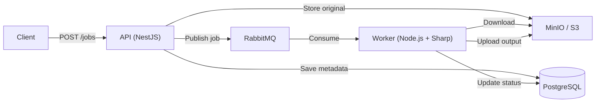

# FrameForge

Event-driven media processing platform built on Kubernetes. Upload images via a REST API, queue them in RabbitMQ, and let workers asynchronously process them into thumbnails, resized variants, and WebP formats.

## Architecture



- **API** (`apps/api`): Receives uploads, validates files, stores originals in MinIO, persists job metadata in PostgreSQL, and publishes jobs to RabbitMQ.
- **Worker** (`apps/worker`): Consumes RabbitMQ jobs, downloads originals, transforms with Sharp, uploads outputs, and updates job status.
- **Shared** (`packages/shared`): TypeORM entities, queue contracts, and message types shared between API and Worker.

## Prerequisites

- Node.js 24 (see `engines` in `package.json`)
- Docker & Docker Compose
- `kubectl` and `helm` (for Kubernetes deployment)
- `kind` or a Kubernetes cluster (for K8s deployment)

## Quick Start (Local Development)

```bash
# 1. Start infrastructure (Postgres, MinIO, RabbitMQ)
docker compose up -d

# 2. Copy environment file
cp .env.example .env

# 3. Install dependencies
npm install

# 4. Build shared package (required before API/Worker)
npm run --workspace @frameforge/shared build

# 5. Start the API
env $(cat .env | xargs) npm run dev:api

# 6. In another terminal, start the Worker
env $(cat .env | xargs) npm run dev:worker
```

The API will be available at `http://localhost:3000`.

### Service URLs (Local)

| Service        | URL                           | Credentials                 |
| -------------- | ----------------------------- | --------------------------- |
| API            | http://localhost:3000         | —                           |
| API Metrics    | http://localhost:3000/metrics | —                           |
| Worker Metrics | http://localhost:9090/metrics | —                           |
| PostgreSQL     | localhost:5432                | `frameforge` / `frameforge` |
| MinIO Console  | http://localhost:9001         | `minioadmin` / `minioadmin` |
| RabbitMQ Mgmt  | http://localhost:15672        | `frameforge` / `frameforge` |

## API Endpoints

### Upload a Job

```bash
curl -X POST http://localhost:3000/jobs \
  -F "file=@photo.png" \
  -F "mediaType=image" \
  -F "processingProfile=thumbnail"
```

**Profiles**: `thumbnail` (200×200), `resized-800` (800×800), `webp` (full-size WebP)

**Response**:

```json
{
  "id": "uuid",
  "status": "queued",
  "mediaType": "image",
  "processingProfile": "thumbnail"
}
```

### Check Job Status

```bash
curl http://localhost:3000/jobs/{id}/status
```

### Get Full Job Details

```bash
curl http://localhost:3000/jobs/{id}
```

### List Jobs

```bash
curl "http://localhost:3000/jobs?page=1&limit=20&status=done"
```

### Health Check

```bash
curl http://localhost:3000/health
```

### Metrics

```bash
curl http://localhost:3000/metrics
```

## API Documentation

- **Swagger UI (live)**: `http://localhost:3000/api/docs` — available when the API is running
- **Swagger UI (static)**: [GitHub Pages](https://d4ni674.github.io/frameforge-k8s-media-pipeline/) — always up to date
- **OpenAPI spec**: [`docs/openapi.json`](docs/openapi.json)
- **Postman collection**: [`docs/frameforge-api.postman_collection.json`](docs/frameforge-api.postman_collection.json)

## Testing

### Unit Tests

```bash
# Run all workspace tests
npm run test

# Run tests for a single workspace
npm run --workspace @frameforge/api test
npm run --workspace @frameforge/worker test
npm run --workspace @frameforge/shared test
```

### End-to-End Tests

Requires infrastructure running (`docker compose up -d`).

```bash
# Build all workspaces first (shared must build before api/worker)
npm run --workspace @frameforge/shared build
npm run --workspace @frameforge/api build
npm run --workspace @frameforge/worker build

# Start API and Worker in separate terminals, then:
cd e2e && npm install && npm test

# Or from root:
npm run test:e2e
```

### Lint & Format

```bash
npm run lint
npm run lint:fix
npm run format
npm run format:check
```

## Deployment

### Kubernetes (kind + Helm)

See [`docs/deployment-guide.md`](docs/deployment-guide.md) for full details.

Quick summary:

```bash
# Create cluster
kind create cluster --name frameforge

# Build images
docker build -f apps/api/Dockerfile -t frameforge-api:0.1.0 .
docker build -f apps/worker/Dockerfile -t frameforge-worker:0.1.0 .
kind load docker-image frameforge-api:0.1.0 --name frameforge
kind load docker-image frameforge-worker:0.1.0 --name frameforge

# Deploy infrastructure and application
kubectl create namespace frameforge
kubectl apply -f infra/k8s/infra/
helm install frameforge ./charts/frameforge -n frameforge
```

## Scaling

### Local / Docker Compose

Workers are single-process. To scale processing locally, run multiple worker terminals with different `METRICS_PORT` values:

```bash
# Terminal 1
env $(cat .env | xargs) npm run dev:worker

# Terminal 2
env $(cat .env | xargs) METRICS_PORT=9091 npm run dev:worker

# Terminal 3
env $(cat .env | xargs) METRICS_PORT=9092 npm run dev:worker
```

All workers connect to the same RabbitMQ queue and compete for jobs.

### Kubernetes (Helm + KEDA)

KEDA is configured in the Helm chart but disabled by default.

To enable autoscaling based on queue depth:

```bash
helm upgrade frameforge ./charts/frameforge -n frameforge \
  --set keda.enabled=true
```

This creates a `ScaledObject` that monitors `media.jobs` queue depth and scales workers between `0` and `10` replicas (default settings).

**Manual scaling** (without KEDA):

```bash
kubectl scale deployment frameforge-worker --replicas=3 -n frameforge
```

**Scale API**:

```bash
kubectl scale deployment frameforge-api --replicas=2 -n frameforge
```

### Verify Scaling

1. **Queue depth**: Check RabbitMQ Management UI at `http://localhost:15672` (port-forward if on K8s).
2. **Worker replicas**: `kubectl get pods -n frameforge`.
3. **Prometheus metrics**: Worker exposes `frameforge_worker_jobs_started_total`, `frameforge_worker_jobs_completed_total`, etc.
4. **Grafana dashboard**: Imported automatically when monitoring stack is deployed.

## Project Structure

```
.
├── apps/
│   ├── api/              # NestJS REST API
│   └── worker/           # Queue consumer & image processor
├── packages/
│   └── shared/           # TypeORM entities, contracts
├── charts/
│   └── frameforge/       # Helm chart
├── infra/
│   ├── k8s/              # Kubernetes manifests
│   └── argocd/           # Argo CD app manifest
├── e2e/                  # End-to-end tests
├── docs/
│   └── deployment-guide.md
└── AGENTS.md             # Developer quick-reference
```

## Security

- `.env` is gitignored; application secrets are injected via environment variables and Kubernetes Secrets at runtime.
- K8s manifests include default local-dev credentials; Helm values require explicit `--set` overrides (enforced by `required`). Rotate all credentials before production.
- Docker images run as non-root user (`frameforge`).
- Kubernetes manifests include `runAsNonRoot`, `allowPrivilegeEscalation: false`, and `capabilities: drop: [ALL]`.
- NetworkPolicies restrict pod-to-pod traffic.
- CI runs `npm audit` and Trivy vulnerability scans on Docker images.

## License

[MIT](LICENSE)
